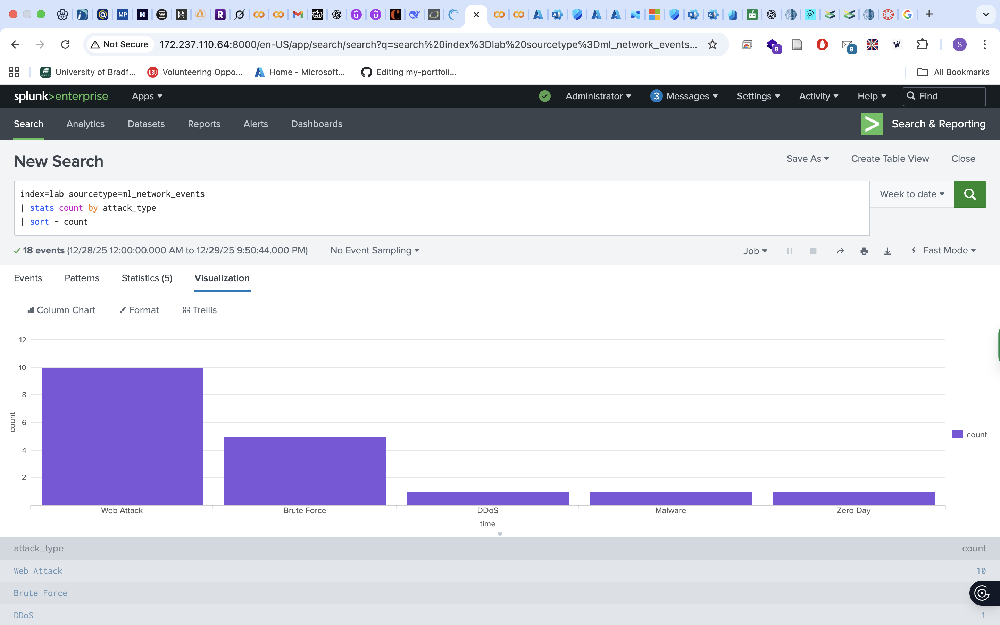

# Machine Learning Threat Detection Pipeline

**Enterprise-ready SOC ML + Threat Intel + SOAR automation**
Enterprise-ready ML pipeline: Colab-based model training ➔ Splunk lookup ingestion ➔ OTX enrichment ➔ SOAR playbook automation with AI-assisted decisions.

🔗 Related: [Threat Hunting Repository](https://github.com/somtech4/threat-hunting)

---

## TL;DR

Production-style ML pipeline for detecting DDoS, SQL injection, brute force, malware, and zero-day anomalies.
Includes:

* Google Colab notebook for model training
* Python scripts for preprocessing, scoring, and Splunk lookup exports
* AlienVault OTX integration
* SOAR playbooks with AI-assisted decisioning
* Designed for SOC automation demos, interviews, and enterprise readiness

---

## Repository Structure

* `notebooks/` — Google Colab notebooks
* `src/` — Python modules: preprocessing, training, scoring, OTX integration, Splunk export
* `splunk/` — Dashboards, lookups, saved searches
* `playbooks/` — SOAR automation examples
* `screenshots/` — Demo images & placeholders
* `docs/` — Architecture diagrams, threat models

---

## Architecture & Data Flow

*(Insert diagram: `docs/architecture.png` — recommended 1200×600)*

**Pipeline flow:**
Logs ➔ Splunk ➔ ML lookup join ➔ Correlation ➔ Notable ➔ SOAR ➔ AI decision ➔ Action

---

## Demo Screenshots

![Colab upload] 

![SMOTE results] 

![Model results]

---

## Quickstart

### 1. Environment Setup
python -m venv venv
source venv/bin/activate
pip install -r requirements.txt

### 2. Run Notebook
Open `notebooks/ML_Threat_Detection.ipynb` in Google Colab.

### 3. Export Predictions
python src/splunk_export.py --input results/predictions.csv --output splunk/lookups/processed_threat_data.csv

### 4. Splunk Lookup Setup
| inputlookup ml_threat_lookup
| lookup otx_lookup malicious_ip AS src_ip OUTPUT malicious_ip AS otx_hit
| eval severity = case(
    otx_hit=="True","Critical",
    zero_day_flag=="-1","High",
    ml_prediction!="0","Medium",
    true(),"Low"
)
| where severity!="Low"

## SOAR Playbooks

* `playbooks/ai_threat_response.yml` — AI-assisted analyst decisions
* `playbooks/zero_day_containment.yml` — Zero-day threat containment

## Metrics (Example / placeholders)

* Test F1: 0.86
* OTX match rate: 2.3%
* Average inference: 5ms per event

## Roadmap

* Add CI: pytest + flake8 + notebook execution checks
* Docker container for model inference
* Automated OTX refresh via GitHub Actions
* Demo GIF / video walkthrough
* Expand SOAR playbooks and threat coverage

## Contributing

See `CONTRIBUTING.md`.

## Security

See `SECURITY.md` for responsible disclosure procedures.

---

## Contact

Email: somtoeze21@gmail.com
LinkedIn: www.linkedin.com/in/joshua-eze
