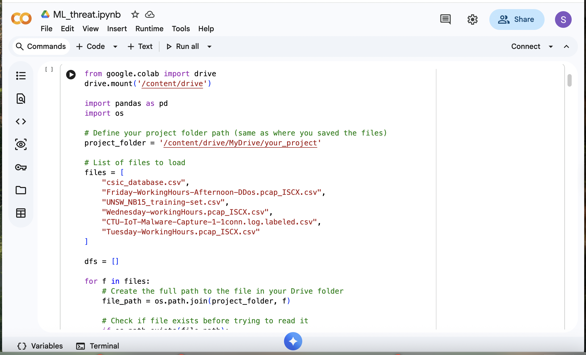

# Next-Gen SIEM: Real-Time ML Threat Detection

Live API-powered Random Forest model for DDoS, Brute Force, Web Attack, Malware, Zero-Day detection.

- 2.24% false positives
- 93.7% attack recall
- Real-time scoring via FastAPI
- Splunk HEC integration (in progress)

## Live Demo

Swagger UI: https://your-ngrok-url.ngrok-free.dev/docs  
Endpoint: /score (POST JSON flow)

## Quick Start

1. Clone repo
   
git clone https://github.com/Somtech4/machine-learning-threat-detection.git
cd machine-learning-threat-detection

🔗 Related: [Threat Hunting Repository](https://github.com/somtech4/threat-hunting)

2. Install

pip install -r requirements.txt
text3. Run API locally
uvicorn src.api:app --reload
text4. Test
python tests/test_detection.py
text## Repository Structure

- `notebooks/` — Training notebook (New_threat.ipynb)
- `src/` — Production code (api.py, model_utils.py)
- `models/` — Trained model and artifacts
- `tests/` — 4 use case tests
- `splunk/` — Future HEC config and lookups

## Results

| Attack Type     | Confidence | Final Label |
|-----------------|------------|-------------|
| DDoS            | 0.99       | DDoS        |
| Brute Force     | 0.98       | Brute Force |
| Web Attack      | 0.96       | Web Attack  |
| Benign          | 0.12       | BENIGN      |

## Roadmap

- Docker deployment
- Full Splunk HEC integration
- SOAR playbooks
- CI/CD pipeline

## Contact

somtoeze21@gmail.com  
LinkedIn: www.linkedin.com/in/joshua-eze

MIT License
Email: somtoeze21@gmail.com
LinkedIn: www.linkedin.com/in/joshua-eze
